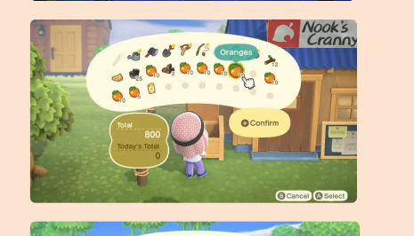
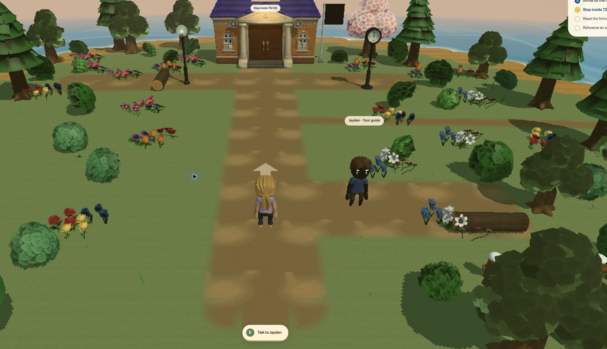
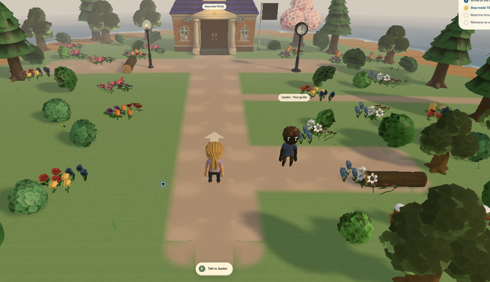
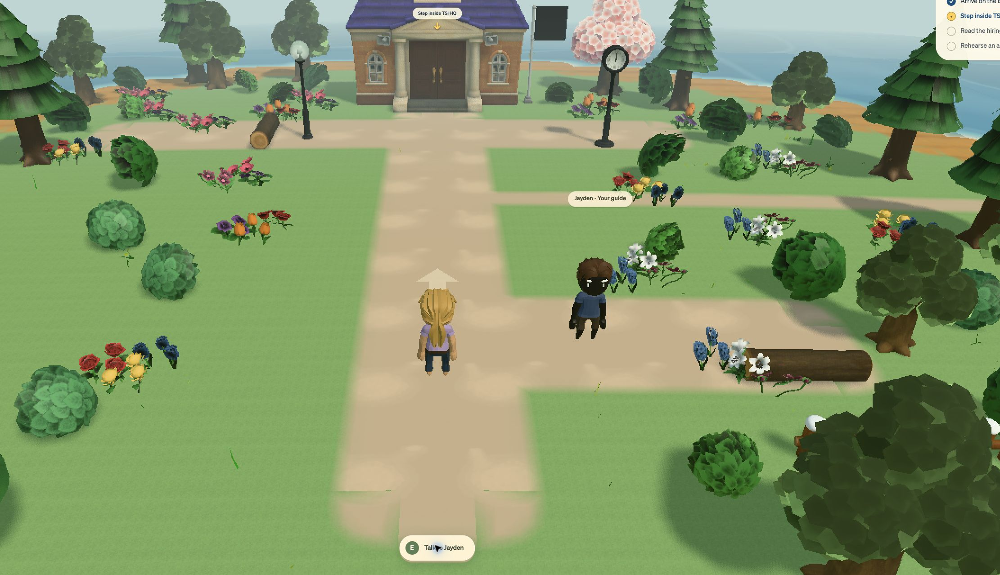
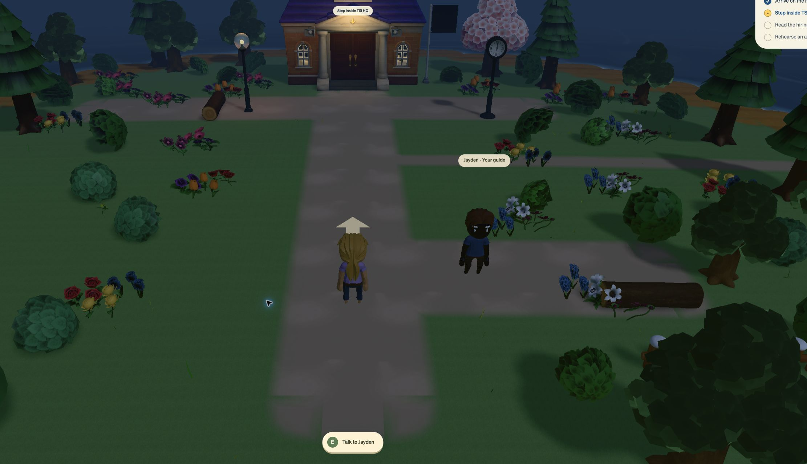
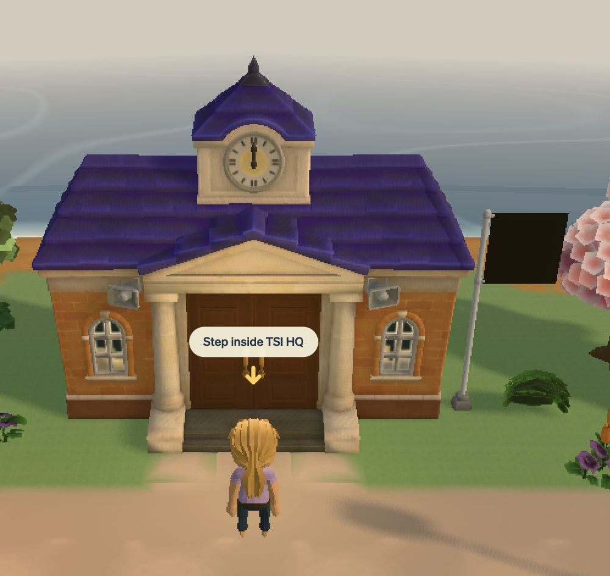
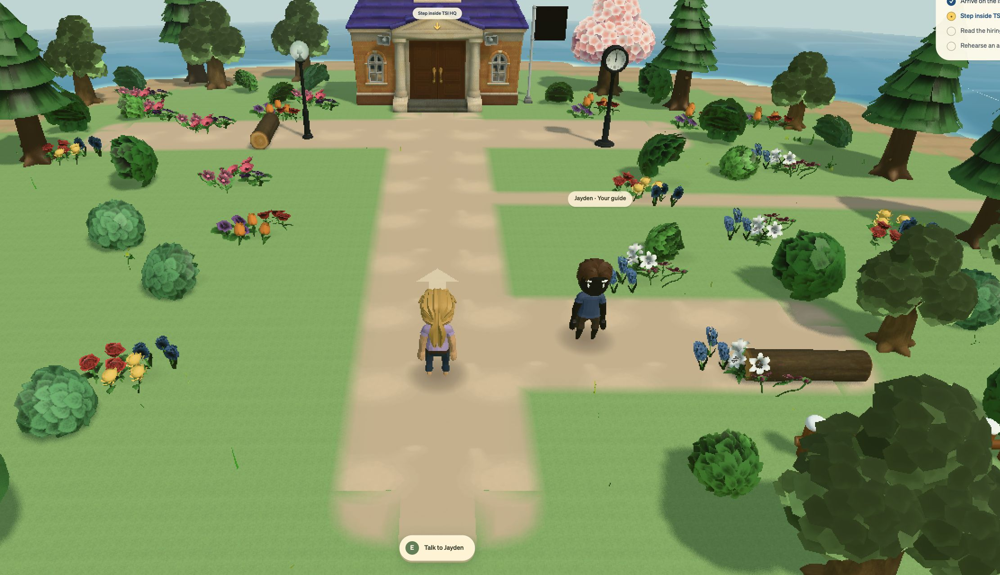
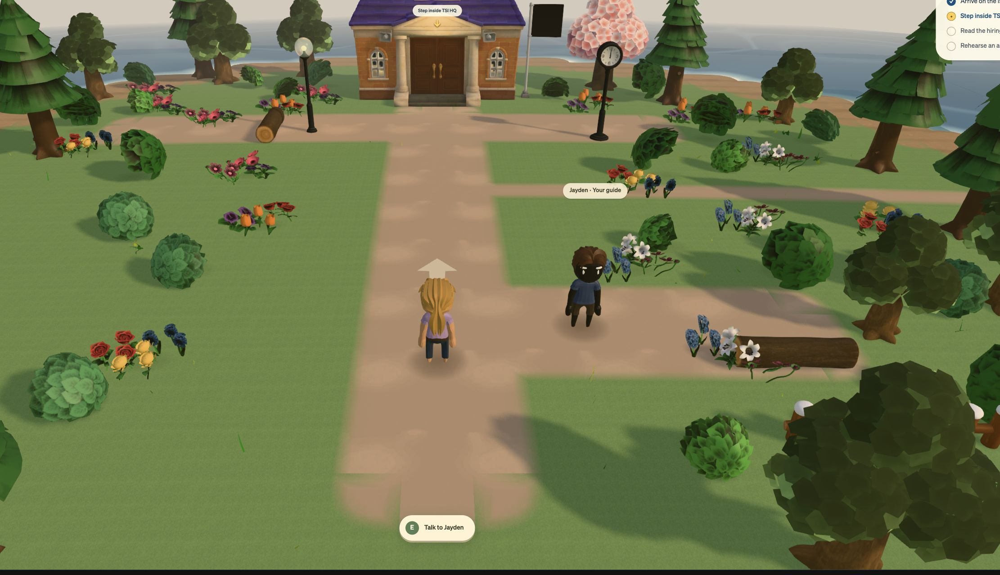
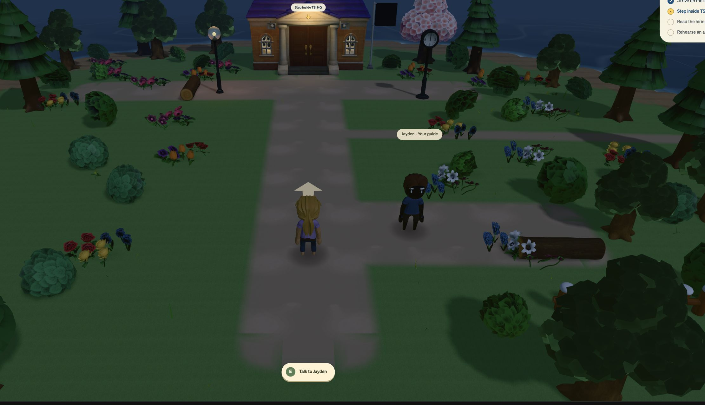

# Applicant island lighting research and implementation

Date: September 16, 2026 (America/Toronto). Local implementation on `feat/director-developer-recruitment`.

## Outcome and scope

David requested a more comforting Animal Crossing-like island: better grass and dirt, convincing light on surfaces, and gentle atmospheric depth. The implementation targets the applicant village at `/student/apply/portal`, the active game in this conversation. Existing models, gameplay, character customization, landscape and HQ are retained. The separate advanced member-game worktree is a source, not a second checkout modified by this task. No deployment or production writes.

Completion checks: compare the same spawn/camera in evening before/after; inspect daylight, evening, night and lighter graphics; keep nearby characters/path readable; maintain distinct terrain colors and visible shadows; enter/leave HQ without outdoor atmosphere leaking indoors; run type/lint and relevant regression tests. Exact Nintendo engine parity is not an achievable or evidenced claim.

## Research findings and evidence limits

Nintendo's furniture lead says increasing detail for HD still required each object to fit the larger world. Realism alone was insufficient. This supports coordinated art direction and recognizable materials rather than maximizing detail everywhere. [Nintendo staff interview, undated; accessed September 16, 2026](https://www.nintendo.co.jp/jobs/keyword/90.html).

Monolith Soft's actual ACNH asset team describes reducing distracting bucket bands/rivets, studying how light changes across real pine flooring and grooves during a day, and keeping background objects distinctive without making each one demand attention. These are direct production principles. [Monolith Soft interview, February 1, 2022](https://www.monolithsoft.co.jp/interview/kyoto/vol01.html).

Nintendo's CEDEC art session describes reconsidering the art concept for HD. Its official abstract does not publish the game's rendering pipeline; presentation materials were not planned for public release. [CEDEC session, September 4, 2020](https://cedec.cesa.or.jp/2020/session/detail/s5e83d23ea16ad.html).

The supplied Nook's Cranny screenshot shows warm lighting, restrained terrain detail, readable colored shade and reduced contrast in distant scenery. The image supports those observations, but cannot establish whether a particular soft area comes from fog, depth of field, bloom or capture compression. Nintendo's exact LUT, tone mapper, fog equation, shadow filter and effect strengths were not verified. The values below are our artistic calibration, not extracted Nintendo settings.

The older [lighting research](lighting-research.md) remains useful historical context. Its absolute statements about what ACNH “actually is” exceeded the evidence available in this pass and are now explicitly qualified.

## Full effect inventory evaluated for this pass

This is a practical inventory of the ingredients relevant to the reference, not a claim to enumerate Nintendo's proprietary renderer. “Retained” means the game already had the feature and no duplicate was created.

| Ingredient | Contribution | Application/status |
|---|---|---|
| Cohesive silhouettes and detail hierarchy | Lets the whole scene read before tiny details | Retained real tree/building/prop assets; no replacement models. Confirmed art principle above. |
| Coordinated surface palette | Grass, path and beach stay distinct under shared lighting | Applicant-only grass `#91b477`, soil multiplier `#edceb0`, sand multiplier `#fff1d5`. These are material inputs, not desired screenshot RGB. |
| Warm directional sunlight | Establishes volume and sunny areas | Day/evening key colors, intensity and direction tuned together. Evening sun is lower and warmer. |
| Cool sky fill | Keeps shaded surfaces readable and colored | Phase-specific hemisphere and ambient lights replace the fixed daylight fill. |
| Ground bounce | Connects the underside of props to land | Muted green/tan lower hemisphere color plus existing environment map. An approximation, not simulated global illumination. |
| Environment lighting | Adds broad, soft reflection/light response to standard materials | Reused `envLight.ts` PMREM with matching phase palettes. Baked only on setup or phase changes. |
| Soft cast shadows | Shows tree/prop position and sun direction without hard cutout edges | Existing shadow map retained; PCF filtering, 2048×2048 resolution, radius 3, intensity 0.85. No extra shadow renderer. |
| Contact grounding | Prevents feet and objects floating visually | Reused the existing soft blob texture for the 3D player and guide; low-opacity instanced contact shade under bushes and flowers. Model cast shadows remain. No screen-space AO pass. |
| Aerial perspective | Separates foreground, middle distance and horizon | Reused `aerialFog.ts`: distance-based desaturation before fog tint; near player/path remain clear. |
| Sky/fog continuity | Avoids a hard horizon boundary | Matching background/fog color per phase. Fog and water palettes now agree with time of day. |
| Low-contrast terrain detail | Suggests material without visual noise | Retained real soil albedo/normal maps. Compressed broad bright albedo marks to 35% of their original variation; soil normal strength 0.18. |
| Light-reactive grass detail | Light reveals surface texture | Retained real two-channel grass normal map and its Z reconstruction; no new generated texture. Existing triangle detail remains a linear color multiplier. |
| Material-specific roughness | Ground stays matte while other materials retain their response | Retained standard GLTF/terrain materials and existing roughness. No global glossy or toon override. |
| Soft path boundaries | Joins dirt and grass naturally | Retained existing eased grid outlines and vertex-alpha surface blending. |
| Highlight roll-off | Keeps bright surfaces from harsh clipping | Retained the existing Neutral tone mapper. One tone-mapping stage in the postprocessing chain. |
| Restrained grading | Unifies the scene without a sepia veil | Reduced blanket warmth, desaturation, black lift and vignette. Exposure stays 1; no adaptive exposure pumping. |
| Selective bloom | Optional small glow around bright emitters | Retained the existing user-controlled bloom path; applicant intensity 0.22 when enabled. Not forced on, and not used to fake distance haze. |
| Drifting cloud shade | Adds slow variation across land | Reused `CloudShadows`, bounded to a feathered 28×25 ellipse on the small island. No dark rectangular overlay across the sea. |
| Gentle environmental motion | Helps the scene feel inhabited | Retained original seagull model/pathing, existing foliage motion and water shader. No new fauna implementation. |
| Day/evening/night mood | Coordinates lighting, water and atmosphere | Three explicit palettes follow the existing Toronto clock. This pass does not add a weather simulator or continuous astronomical sun model. |
| Stable rendering and texture scale | Keeps silhouettes and navigation clear | Retained pixel-finish preference and smooth toggle. Both are visually checked; no new quantization/dither. No global texture-filter change. |
| Depth of field | Can soften distant scenery in a camera-like way | Evaluated, not added: depth separation is supplied by haze. Whole-screen blur would impair navigation; a future far-only DOF pass requires a measured benefit. |
| SSAO, volumetric fog and light shafts | Can add contact depth or weather drama | Evaluated, not added: exact Nintendo use is unverified here; existing shadows/environment/fog meet this scene's need without extra full-screen passes. |

Three.js implements fog by camera depth, and its built-in fog shader provides the smooth distance interpolation used here. [Official Fog documentation](https://threejs.org/docs/pages/Fog.html). Texture color data must have a declared color space; normal/data maps must retain data values. [Official Texture documentation](https://threejs.org/docs/pages/Texture.html). Shadow resolution/filtering/bias trade visual quality against cost, and frozen shadow maps require explicit invalidation. [Official LightShadow documentation](https://threejs.org/docs/pages/LightShadow.html). The existing bloom threshold of 1 selects HDR-bright content. [React Postprocessing Bloom documentation](https://react-postprocessing.docs.pmnd.rs/effects/bloom).

## Existing implementation audit

Read current code, `specs/lighting-research.md`, reference images and `.claude/worktrees/restart-art-cohesion` before implementation. The advanced `DefaultIslandWorld.tsx` already coordinates evening sun and night water. Its `PostFX.tsx` and `grid/terrainMaterials.ts` match this checkout; copying/rebuilding them would add nothing. The shared `envLight.ts`, `aerialFog.ts`, `AmbienceFX.tsx`, grass normal reconstruction, surface blends and current postprocessing are reused.

The applicant previously had a beige evening sky but unchanged sun direction/color and fixed daylight ambient/hemisphere fill. It lacked environment lighting and the existing aerial-desaturation import. Soil multiplied its real albedo by dark ochre before another warm grade. Source inspection showed the conspicuous path patches were painted into the supplied soil albedo, so their contrast was reduced in the local material rather than replacing the texture.

## Exact lighting and grading

Source of truth: `web/lib/game/applicantLighting.ts`.

| Setting | Day | Evening | Night |
|---|---|---|---|
| Background/fog | `#c7e0df` | `#ddd5cc` | `#344963` |
| Sun/moon color | `#fff5df` | `#ffddb1` | `#bbcbea` |
| Key intensity | 2.8 | 2.55 | 0.95 |
| Key position | -12,24,-14 | -22,16,-12 | -12,20,-14 |
| Sky fill | `#c4deef` | `#c0cce7` | `#97b2d9` |
| Ground fill | `#a7b68a` | `#a7aa85` | `#53684f` |
| Ambient/hemisphere | 0.22 / 0.72 | 0.22 / 0.72 | 0.17 / 0.35 |
| Environment strength | 0.38 | 0.40 | 0.30 |
| Fog near/far | 22 / 70 | 20 / 64 | 18 / 59 |
| Warmth / desaturation | 0.18 / 0.035 | 0.30 / 0.035 | 0 / 0.06 |
| Black lift | 0.25 | 0.30 | 0.20 |
| HQ entrance light | 0.6 | 4 | 6 |

All phases: exposure 1, contrast 1, vibrance 0, vignette 0.1. Fog parameters are camera-depth scene units, not meters. Black lift/warmth are existing grade multipliers, not direct opacity. Night water reuses the advanced island's blue palette. Bloom remains opt-in. Lighter graphics disables postprocessing, cloud shade and cast shadows; material palette, key/fill, environment and fog still operate.

## Integration details

- `ApplicantWorld.tsx`: binds the coordinated profile, shared environment, existing haze and bounded cloud shade. Shadow updates occur after scene/phase/quality changes and after late asset loading. Cached shadows remain inexpensive while the player uses its existing moving decal.
- `GridWorld.tsx` / `GridTerrain.tsx`: optional palette clones only the applicant's grass/dirt/sand materials. Preserves textures, grass shader hooks, shared normal-strength controls and existing member defaults. Disposes only owned clones; cached textures remain owned by the existing terrain system.
- `envLight.ts`: replaces process-wide PMREM/render-target state with per-scene ownership. Scene switches and different WebGL renderers cannot dispose each other's maps. Both target and generator are cleaned up.
- `AmbienceFX.tsx`: optional small bounds with edge fading; existing member-world call/default dimensions remain unchanged.
- `AmbientProps.tsx`: reuses its existing `Lantern` as an export with optional intensity/glow. Applicant streetlight is off in daylight and casts a warm, non-shadow-mapped light pool in evening/night; original member defaults remain unchanged.
- `grassTexture.ts`: explicitly marks the existing generated RGB multipliers as linear-sRGB; no pixel values changed.
- `ApplicantIsland.tsx`: development preview can select a lighting phase; production continues to follow Toronto time. Character setup inside HQ no longer starts an outdoor-only arrival sequence. Intro effect cleanup no longer prematurely completes a Strict Mode remount.
- `interiorShared.tsx`: cleanup restores only background/fog values the interior still owns. Browser QA found it was overwriting the newly attached exterior after leaving HQ; two regression tests cover overlay restoration and new-scene ownership.
- `PostFX.tsx`: reused without another composer or output pass. The composer disables renderer tone mapping; its existing terminal Neutral effect remains necessary.

## Reproducing the visual checks

Start the existing development server and use:

- `/student/apply/portal?preview=1&lighting=day`
- `/student/apply/portal?preview=1&lighting=evening`
- `/student/apply/portal?preview=1&lighting=night`

The override is gated by development preview. Use the same entrance spawn and wait for the cloud descent to finish. The existing menu exposes Pixel finish and Lighter graphics. Screenshots are cropped to identical 2000×1150 CSS-pixel rectangles; animation/cloud positions vary naturally. Before/after evening images both use pixel finish. The final daylight capture also uses pixel finish; the night capture uses smooth mode. Both modes were checked, but their detail differences are not lighting-only changes.

### Before: evening

### After: evening

### Daylight, pixel rendering

### Night, smooth rendering

### Exterior restored after visiting HQ

## Verification

TypeScript and focused ESLint pass. 41 tests pass across environment ownership/lifecycle, material cloning, terrain blending, island collision/navigation, time mapping, camera arrival, graphics settings and context handling. No dependencies added. Verification covers the changed rendering integration, not recruitment backend release gates.

Dia visual walkthrough passed: evening before/after at the same spawn, daylight and night in smooth mode, night with Lighter graphics, and village → HQ → village. The interior remains free of exterior haze and environment lighting; exterior lighting/shadows restore on return. Original Pixel finish on / Lighter graphics off preferences were restored after testing. The in-game counter sampled 144 FPS / 280 draws for evening pixel mode and 124 FPS / 280 draws for night smooth mode; these are brief development-session observations, not a controlled performance benchmark. One development hot-reload hook-dependency warning occurred while editing; it did not recur on clean navigation. No new shader errors were observed after clean navigation. The final isolated Dia-tab round trip returned an empty error log and visibly retained the evening horizon haze after leaving HQ. Full production build, low-end laptop performance, authenticated application submission and the separate member-world route are not asserted by this visual pass. No visual claim relies solely on unit tests.

## Follow-up graphics polish (September 16, evening)

David requested continuing the lighting/graphics implementation. Same scope and reuse rule. A same-camera inspection found three concrete remaining problems: excessive middle-distance wash, an orange beach albedo, and almost invisible character grounding.

- **Haze:** moved the fog ranges outward (table above) so HQ and nearby trees retain their shape/color while the ocean horizon still fades. The first-pass screenshots above are historical; follow-up captures below show the revision.
- **Grounding:** the old player shadow is a tiny mark inside a 32px sprite tile. For the 3D applicant only, the existing decal now uses `getBlobTexture()` from `BlobShadows.tsx`. Jayden uses the same existing system. Bush/flower contact shade is one instanced draw at opacity 0.16, supplements cast shadows and follows picked-flower removal. No duplicate player decal. These simple contact shadows remain in lighter graphics.
- **Cast-shadow detail:** static map increased from 1024 to 2048, radius 3, normal bias 0.02. Still cached rather than rendered every frame. This improves small prop/branch silhouettes with no additional lights.
- **Beach:** inspected the original `mSand_Alb.png`, confirmed its strong orange pigment, and retained its grain while blending chroma toward a lifted luminance value in the applicant's cloned material. Formula: `mix(vec3(luma + 0.1), albedo, 0.45)`. Shared source material/texture remains unchanged.

### Daylight before this follow-up (pixel finish)

### Daylight after this follow-up (pixel finish)

### Smooth-mode edge treatment

`PostFX.tsx` now accepts an optional `antialias` flag, enabled only for the applicant's smooth graphics mode. Pixel finish and lighter graphics retain their prior behavior. The final implementation uses the installed library's [FXAA effect](https://react-postprocessing.docs.pmnd.rs/effects/fxaa) in the existing composer. FXAA precedes the merged vignette/grade/tone mapper: placing it after these transforms produced visible contour artifacts because its neighboring samples still came from the ungraded input. Visual verification caught and resolved this. Member callers default to antialias off. No package added.

4× MSAA and SMAA were evaluated and rejected for this pass after low large-window frame-rate readings. Development samples at the 2831×1422 canvas were roughly 22 FPS with MSAA, 31 FPS with SMAA, and 43 FPS with the final FXAA order. Pixel mode sampled 104 FPS. These were short, non-controlled observations with multiple development tabs and compilation activity, not portable benchmarks or a claim of 60 FPS on low-end hardware. The contact shading adds two instanced draws (282 total observed with final FXAA versus the prior 280). A dedicated hardware performance pass remains open.

### Follow-up verification

- 43 existing regression tests passed across 10 files, including the 41 from the first pass plus two character-animation lifecycle tests.
- TypeScript and focused ESLint passed after the final shader/effect ordering change; `git diff --check` passed.
- Dia: same-camera daylight comparison, evening and night smooth rendering, lighter graphics with contact shadows, and restoring Pixel finish on / Lighter graphics off. Clean verification tab reported no console errors. The editing tab retained a transient missing-import error from the interval between two patches; the import was completed before verification and the clean tab did not reproduce it.
- HQ round-trip was verified in the first pass above, not repeated in this follow-up. No full production build, member-route walkthrough, backend integration or deployment claimed.

## Golden HQ windows and existing firefly assets (September 16, late evening)

David requested fully yellow glowing windows, a more inviting building atmosphere and fireflies using existing assets.

### Asset and implementation audit

- Found the actual ACNH insect model at `web/public/assets/acnh/critters/firefly.glb` in both this checkout and the advanced member worktree. Inspected its two textured materials. No new insect mesh or texture was generated.
- Compared existing `Critters.tsx`, `AmbientLife.tsx`, advanced `IdleFireflies.tsx` and `S7Pockets.tsx`. Adapted the existing AmbientLife drift and pulse, replacing its sphere visual with the real firefly model. Exported its existing Fireflies group with optional local anchors. No duplicate motion system or new catch/collection flow.
- Reused the existing `assets/sky/sun.png` soft radial texture for small additive firefly halos. The insect retains its original model/textures. There are 8 near HQ/flowerbeds at night, 5 in evening, 3 in lighter graphics, none in daylight. Existing drift animation is reused; the GLB contains no skeletal animation.
- Inspected HQ GLB materials and original window albedo/emission textures. `mWindowL`, `mWindowR`, and `mSideWindow` are glass meshes, separate from `mWall` masonry. Previous windows relied on dim textured emission.

### Changes

- Optional `windowColor` on existing ACNH building components sets applicant glass to `#ffc95a`, clearing its dark albedo/emission maps and using solid matching emission. Instance materials are cloned first; original GLTF materials/textures and other building callers remain intact. Emission smoothly follows the existing animation loop: 0.3 daylight, 1.15 evening, 1.6 night.
- Two warm spill lights outside the windows, no additional shadow maps. Each is at `(±2, 1.25, 5.7)`, color `#ffd17a`, range 4, intensity 0 in day / 3.4 evening / 5.1 night. Existing porch light moves slightly forward, uses `#ffd68b`, range 5.5 and 1.5× the phase lamp strength.
- Existing ambient Firefly motion accepts optional anchors. Model scale 0.045, horizontal orientation, no cast shadow; 0.38-wide soft halo with staggered opacity pulse from 0.2 to 0.76. No per-firefly lights, no forced fullscreen bloom.

### Verification and limits

20 tests passed (model materials, environment lifecycle, interior backdrop, graphics settings), including a regression asserting only cloned glass is changed and wall/cache textures remain intact. TypeScript and focused ESLint passed. `git diff --check` passed.

Final visual inspection is **pending**: Dia's connector repeatedly timed out on the isolated preview, and native fallback reported concurrent user input. Stopped UI actions to avoid interfering with David's browser. No screenshot or performance result is claimed for this late-evening change. Existing source/model and source textures were inspected directly. Changes remain local; no deployment or production writes.
