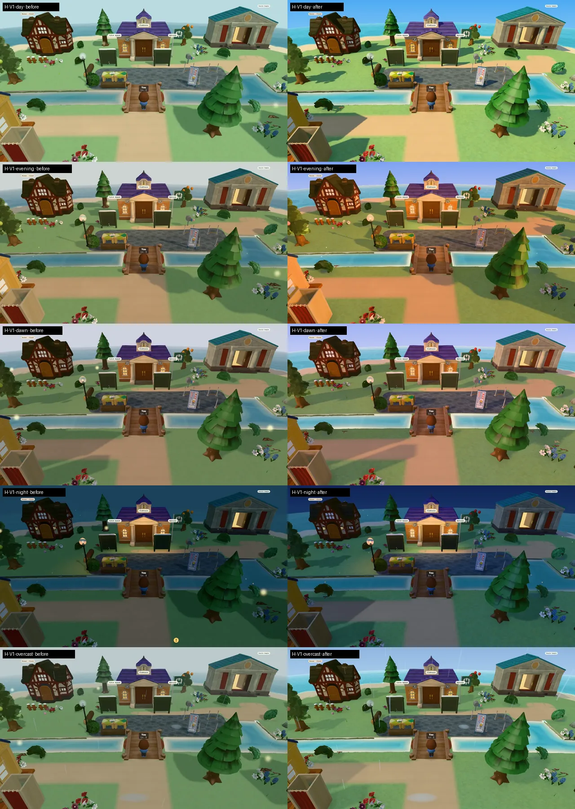

# Open-air sun applied (row 236, look-development.md §5)

Branch `game/look-apply`, 2026-09-27. Same rig and cameras as `specs/look/baseline.md` (headed Chromium on the
M4 Mac mini, 1280×720 at DPR 1, smooth mode, `?season=summer`, signed out, dev build), shot with
`PORT=4700 node specs/evidence/look/shots.mjs baseline <dir>`, so every after frame lines up with its before.
Frames: `specs/evidence/look/after/`; before/after sheets (before left, after right) from
`specs/evidence/look/sheets.py`: `sheet-H-V1`, `sheet-H-V2`, `sheet-L-V1`, `sheet-H-V3-L-V2`, `sheet-interiors`.
Applicant island (no baseline camera): `applicant-H-day`, `applicant-L-day`, `applicant-H-evening`.

## Where the look lives

One preset, `CURRENT` in `web/lib/game/lookPreset.ts`, is the game's look and the lab's "Current":

- **Day** = the preset. `ISLAND_LIGHTING` (`web/lib/game/islandLighting.ts`) is derived from it for every phase;
  `islandLight(preset, phase)` is what the village, home island, ruins, interiors' grade and the lab all call.
- **Dawn, golden hour, night** = `PHASE_LOOK` multipliers on the day preset (linear-light colour tints, intensity
  and fill scales, sun elevation per phase, golden-hour sun mirrored to screen-right, shadow softness, rim,
  exposure/warmth deltas). Editing the day preset in `/lab/look` moves every phase (unit-tested).
- **Weather** (`withWeather`) and **season** (`withSeason`) layer on top as before; weather now also softens and
  lightens the shadows and scales fill up instead of adding flat ambient.
- **Materials**: `web/components/game/LookMaterials.tsx` (moved out of the lab rig) patches every lit material in
  the member island and applicant Canvases: per-class saturation/value, gloss, the cool shadow tint, and the
  grass detail + hue variation uniform (`TERRAIN_GRASS`, `GridTerrain.tsx`).
- **Post**: `lookFx(preset, highTier)` everywhere, interiors included: tone mapping and grade on both tiers,
  AO and bloom on High only.
- **Interiors** (`CLUBHOUSE_LIGHTING`): key light in the sun's colour, stronger (1.5) over a lower fill; museum
  now reads the same profile. **Applicant island**: same `ISLAND_LIGHTING`, sky gradient, fog colour, shadow
  softness, rim, `LookMaterials` and PostFX on both tiers (Light used to skip PostFX, so it lost the grade).

Deviations from the picked preset, with reasons: `specs/look-development-questions.md` §10-17 (Neutral tone
mapping at 1.5 instead of ACES 0.9, sun lowered 49° → 44°, highlight share, interiors' own exposure).

## Before → after (pixel measurements, `measure.py`)

V1 day, lossless PNGs (before = `baseline.md`):

| | Before | After |
|---|---|---|
| Key:fill (analytic) | 1.42:1 | **3.99:1** |
| Lit:shadow on grass (measured) | 1.92 (R/G/B 2.32/1.87/1.87) | **3.79** (7.23/3.56/2.16, cool shadows) |
| RMS contrast | 0.198 | 0.201 |
| Mean saturation | 0.368 | **0.494** |
| Sky strip saturation | 0.197 | **0.629** |
| L* p5 / p50 / p95 | 20.8 / 68.2 / 85.3 | 20.1 / 69.4 / 80.9 |
| Highlights (L* > 90) | 0.4% | 0.5% |
| Mid-band share (L* 35-65) | 32% | 27% |
| Cast-shadow share | 16.0% | 15.6% |
| Lit-grass texture CV | 0.105 | 0.139 |

Every frame, measured on the WebP evidence on both sides (so compression matches), `before → after`:

| Frame | RMS contrast | Mean sat. | Highlights | L* p5/p50/p95 | Sky sat. | Lit:shadow |
|---|---|---|---|---|---|---|
| H-V1-day | 0.198 → 0.201 | 0.368 → 0.492 | 0.4% → 0.5% | 20.8/68.2/85.2 → 20.2/69.3/81.1 | 0.20 → 0.63 | 1.76 → 3.71 |
| H-V1-evening | 0.188 → 0.166 | 0.376 → 0.533 | 0.3% → 0.3% | 20.2/57.3/84.3 → 22.3/57.3/74.3 | 0.08 → 0.44 | |
| H-V1-dawn | 0.193 → 0.180 | 0.361 → 0.423 | 0.3% → 0.4% | 16.4/51.4/84.5 → 20.3/54.3/78.5 | 0.12 → 0.33 | |
| H-V1-night | 0.102 → 0.121 | 0.531 → 0.519 | 0.1% → 0.1% | 5.7/26.4/37.9 → 8.1/30.7/46.4 | 0.70 → 0.79 | |
| H-V1-overcast (rain) | 0.184 → 0.186 | 0.323 → 0.408 | 0.2% → 0.2% | 16.8/55.3/80.3 → 17.2/58.6/77.8 | 0.11 → 0.36 | |
| H-V2-day | 0.190 → 0.159 | 0.343 → 0.531 | 0.2% → 0.3% | 28.4/69.7/87.5 → 32.7/72.1/88.0 | 0.17 → 0.63 | 1.64 → 2.98 |
| H-V3-day | 0.204 → 0.207 | 0.335 → 0.475 | 0.2% → 0.4% | 26.3/69.6/87.8 → 23.7/73.1/88.0 | 0.19 → 0.60 | 1.59 → 2.37 |
| L-V1-day | 0.195 → 0.191 | 0.369 → 0.493 | 0.5% → 0.7% | 22.0/68.8/85.2 → 23.3/71.1/81.1 | 0.20 → 0.63 | |
| H-hq-day | 0.175 → 0.174 | 0.585 → 0.662 | 0.4% → 0.5% | 5.0/35.4/62.2 → 4.9/37.9/67.6 | | |
| H-cafe-day | 0.183 → 0.185 | 0.724 → 0.786 | 0.3% → 1.2% | 7.5/33.7/65.8 → 8.3/37.7/70.9 | | |
| H-ruins-day | 0.148 → 0.137 | 0.299 → 0.413 | 0.3% → 0.4% | 38.0/63.5/85.2 → 38.4/68.6/75.7 | 0.17 → 0.61 | |

Reading the sheets: every after frame reads sunnier; none is grey. The overview's RMS contrast drops because the
sea, once the darkest mass in the frame, is now bright turquoise; its lit:shadow nearly doubles. Golden hour
has lower RMS than before because its long shadows fill most of the plaza (the point of a low sun); the lit
patches are warm and the shade violet. Rain keeps a soft blue sky and coloured sea instead of the old grey.
Highlights stay under 1% (questions §11).

## Frame rate (V1 day, uncapped, dev build, this M4, other agents running)

| Tier | Before | After |
|---|---|---|
| High (AO, bloom, PCF shadows) | 429 FPS · 358 draws | 234 FPS · 4.28 ms · 432 draws |
| Light (no shadow map, AO or bloom) | 503 FPS · 358 draws | 357 FPS · 2.80 ms · 369 draws (424 FPS on an earlier run) |

High adds about 1.9 ms, mostly AO and bloom (`presets.md` measured the Open-air direction at +1.8 ms). Light
adds 0.4-0.8 ms: the patched material shaders plus run-to-run noise on this shared machine (two after runs
read 424 and 357 FPS). Both stay far above the 30 FPS Light target on this integrated GPU; these rank cost,
they are not a laptop benchmark (questions §9).
