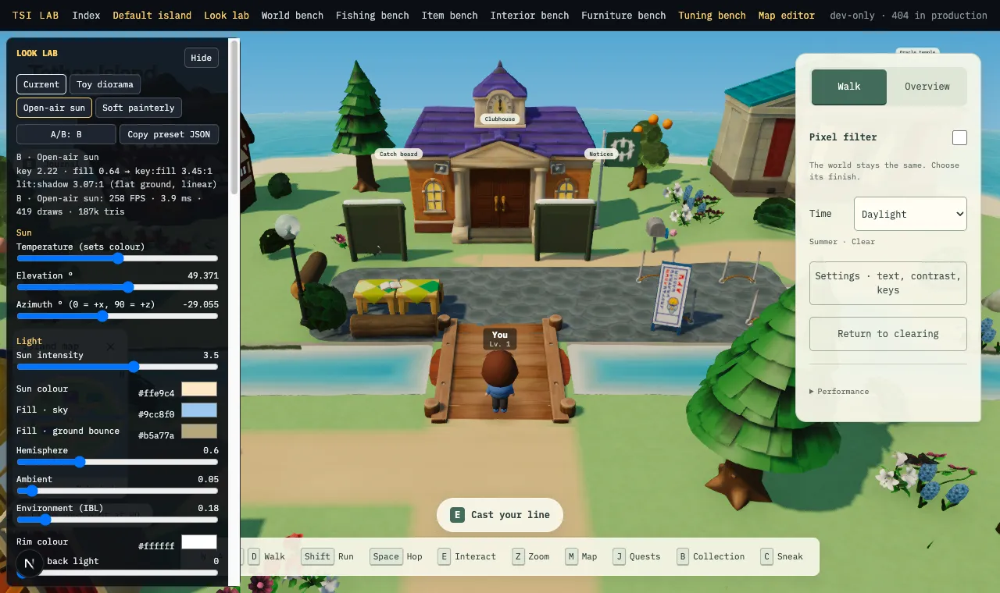
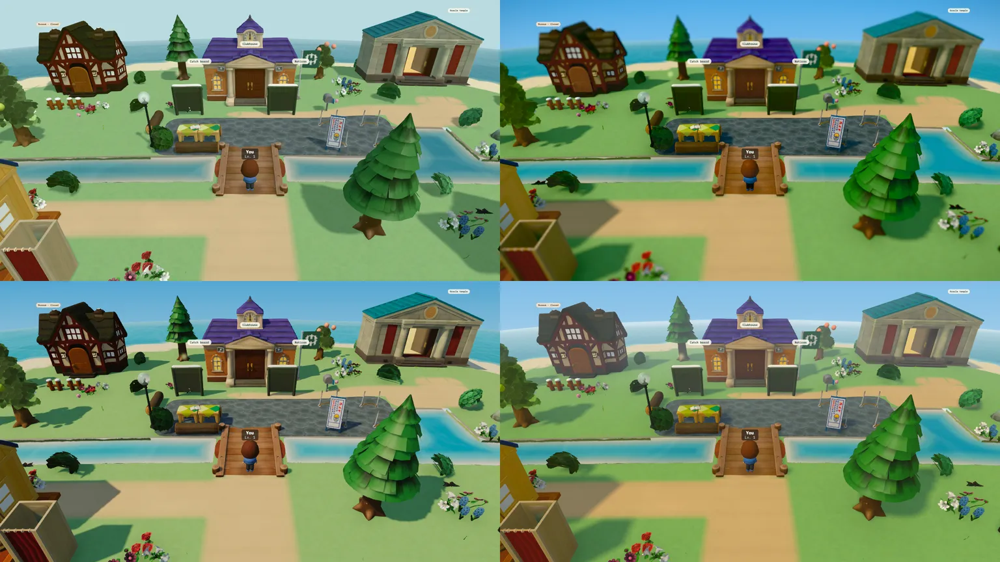
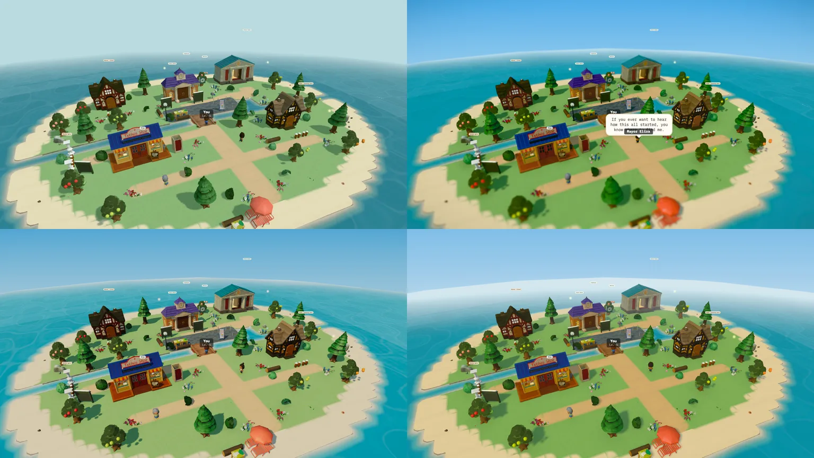
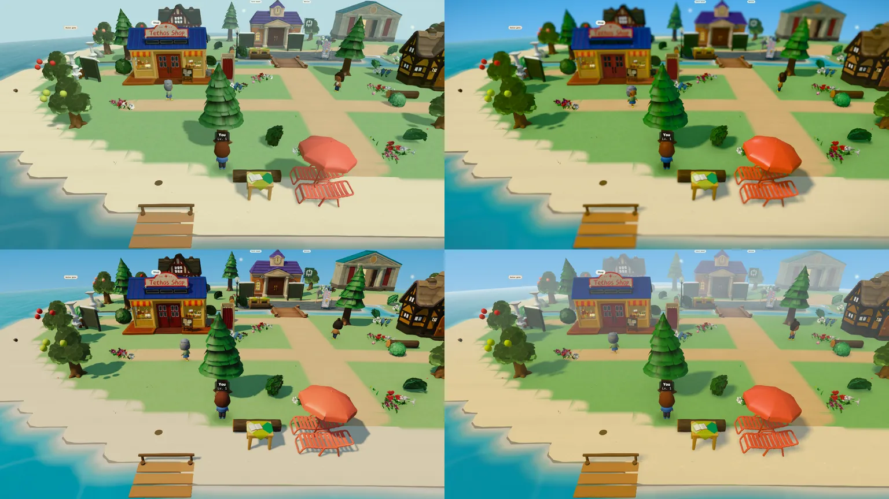
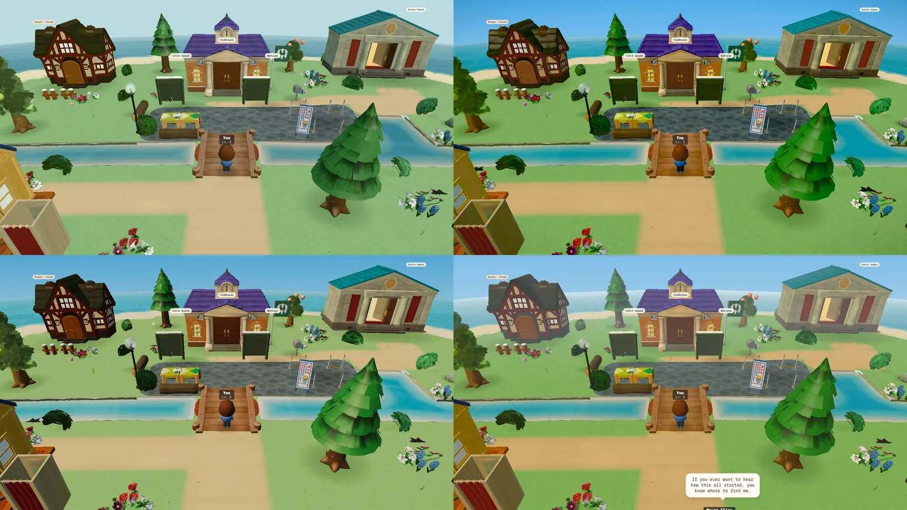

# Look lab and the first three directions (row 235, look-development.md §2)

## The lab

`/lab/look` (dev only; the lab layout 404s every lab route in production). It mounts the real village
(`DefaultIslandWorld`) and drives it through one `LookPreset` (`web/lib/game/lookPreset.ts`):

- `lookToLight` maps the preset onto the game's own `IslandLight` for the phase, and season and weather
  still layer on top (`withSeason`, `withWeather`). `IslandAtmosphere` reads the new optional fields
  (shadow softness/opacity, rim light, sky gradient, fog colour); absent, it renders exactly as shipped.
- `lookFx` maps tone mapping, bloom, tilt-shift and N8AO onto the existing `PostFX` composer. AO,
  tilt-shift and bloom are **High only**: `lookFx(preset, false)` returns them off.
- `web/components/lab/LookRig.tsx` patches the scene's own lit materials once (shared uniform per class,
  no recompiles on slider moves): per-class saturation and value, roughness, toy gloss, and the shadow
  tint (the key light's shadow lerps toward a colour instead of black). It also reports FPS, draw calls
  and triangles.

Panel: four presets, **A/B** (A = the game with no preset, B = the edited preset), **Copy preset JSON**,
**Load preset JSON**, live key:fill and lit:shadow readout, FPS/draws per slot, and every control from
the brief (sun intensity/temperature/elevation/azimuth, sky and ground fill, hemisphere, ambient, IBL,
rim; shadow softness/opacity/tint; AO; per-class materials; tone mapping ACES/AgX/Neutral, exposure,
saturation, vibrance, contrast, warm/cool, lift, vignette, bloom, tilt-shift; sky gradient, fog colour
and distance). URL: `?preset=toy|open-air|painterly|current`, `?look=<json>`, `&ab=A`, plus the game's
own `?time=`, `?weather=`, `?season=`, `?at=x,z`.

Lab parity: Current in slot B against the game in slot A differs by a mean 0.81/255 per channel, below
the 1.06/255 between two frames of the game taken seconds apart (animation), with identical tone
statistics (RMS 0.199 vs 0.198, saturation 0.368 vs 0.368, same L* percentiles). The unit test
`lookToLight(Current, day)` ⊇ the shipped day profile pins it.

## Captures

`specs/evidence/look/presets/`: each preset at V1, V2, V3 on High, V1 on Light, plus the V1 no-shadow
pairs; `sheet-*.webp` are 2×2 contact sheets (top-left Current, top-right Toy diorama, bottom-left
Open-air sun, bottom-right Soft painterly). Same rig as the baseline: day, clear, summer, smooth, 1280×720.

## Numbers (V1, day)

| | Current | Toy diorama | Open-air sun | Soft painterly |
|---|---|---|---|---|
| Key:fill, analytic | 1.42:1 | 1.95:1 | **3.45:1** | 1.93:1 |
| Lit:shadow on grass, measured | 1.92 | 1.67¹ | **3.58** | 1.53² |
| Shadow colour, lit:shadow R/G/B | 2.36/1.88/1.88 | 2.73/1.63/1.87 | 8.27/3.26/2.34 | 1.68/1.53/1.18 |
| Cast-shadow share of frame | 16% | 24% | 14% | 18% |
| RMS contrast | 0.199 | 0.183 | 0.199 | 0.161 |
| Mean saturation | 0.368 | **0.589** | 0.447 | 0.425 |
| Sky strip saturation | 0.197 | 0.623 | 0.553 | 0.414 |
| L* p5 / p50 / p95 | 20.7 / 68.2 / 85.3 | 15.6 / 59.6 / 72.1 | 12.2 / 66.4 / 74.7 | 28.9 / 63.7 / 77.1 |
| **High**: FPS · ms · draws | 446 · 2.24 · 357 | 219 · 4.56 · 423 | 248 · 4.03 · 422 | 238 · 4.19 · 422 |
| **Light**: FPS · ms · draws | 483 · 2.07 · 357 | 485 · 2.06 · 358 | 489 · 2.04 · 356 | 477 · 2.10 · 358 |

¹ Tilt-shift blurs shadow edges in the lower frame, which lowers the measured ratio.
² Radius-6 penumbras dominate the shadow mask; the core shadow is darker than the median says.

Per-effect cost on top of Current (High, V1, same rig): N8AO (half-res, "performance") **+1.11 ms**
(446 → 299 FPS, +47 draws); bloom (mipmap) +0.49 ms (→ 367); tilt-shift (two passes) +0.42 ms (→ 376);
rim light +0.14 ms (→ 420). The three directions cost 1.8-2.3 ms a frame on High, mostly AO. On Light
they cost nothing measurable: the Light tier keeps each preset's light, colour, grade and sky and
drops AO, tilt-shift, bloom and the shadow map. These are uncapped readings on an M4 at 1280×720 in a
dev build, with other agents running; they rank cost, they do not predict a laptop's frame rate. At
Retina DPR 1.5 the post passes scale with pixel count (×2.25).

## Verdicts

- **Current.** Milky and even: grey-cyan sky, pale sage grass, shadows grey and under one stop. It reads
  like an overcast afternoon (see the baseline: rain measures within 8% of it).
- **Toy diorama.** The strongest *style* change. Tilt-shift and the saturated blue sky make the village
  read as a miniature, especially from the overview camera, and glossy props pick up the sky. Costs:
  the most expensive (+2.3 ms), the most saturated (0.59, greens edge toward lime), and the blur hides
  distant landmarks the player navigates by; the shadows are still soft (lit:shadow 1.7). Sunny, but
  as a photograph of a toy rather than as a place.
- **Open-air sun.** Reads sunniest. It is the only direction that reaches the D3 contrast target
  (lit:shadow 3.6 against 1.9), with crisp shadows that are clearly blue (R ratio 8.3 vs B 2.3), a
  saturated sky (0.55 vs 0.20) and lit facades from a 3/4 key on screen-left. Costs: +1.8 ms on High
  (AO and bloom); its highlights top out at L* 75 because ACES at exposure 0.9 compresses the top, so
  the sunlit ground is a little dim (raise exposure toward 1.05 in the lab if it reads heavy), and the
  shadows are the darkest of the four (p5 L* 12).
- **Soft painterly.** Pleasant and saturated with blue, soft shadows, but lower contrast than Current
  (RMS 0.161) and the aerial haze (fog from 12 u) washes the clubhouse and temple out from the shore
  camera. It is the gentlest change; on its own it does not answer "too flat".

**Most promising: Open-air sun**, because it attacks the top three causes directly (fill cut to a
3.45:1 key:fill, blue sky and air, cool visible shadows) with the fewest side effects, and it keeps most
of its gain on the Light tier (sky 0.55, saturation 0.45) where there is no shadow map. The toy
direction's tilt-shift and gloss are worth keeping as optional layers on top of it once David's
references say how far toward "miniature" the look should go.

## What the first tuning pass taught (v1 → v2, 2026-09-26)

- A sun placed *behind* the buildings (z > 0) backlights every facade the camera sees: the first
  Open-air and Painterly drafts put the clubhouse, museum and temple fronts in shade (L* p5 0). All
  three directions now light from screen-left and slightly toward the camera (z −10 to −12).
- ACES with a low fill crushed shadows to black (the first Open-air measured lit:shadow 9 with red
  at zero); a little more hemisphere fill and black lift brought it to 3.6.
- postprocessing's `TiltShift` blurs into an 8-bit target and banded wherever lit ground was above 1.0
  in HDR. The lab uses two passes of r3f's `TiltShift2`, which samples the HDR input directly.
- Terrain saturation above ~1.05 on top of a vibrance boost turns the grass lime; the directions keep
  terrain at 1.0-1.05 and put saturation into the sky, props and foliage instead.
